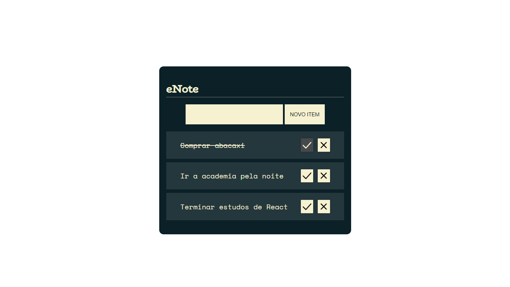

# Sobre o eNote
Uma aplicação que utiliza JavaScript puro, onde é possível criar anotações, tarefas, definir a conclusão da tarefa ou remove-lás. Criado a partir de um curso da Alura, no qual pude aprender a manipular o DOM, componetizar o projeto e trabalhar com módulos.

## Apresentação do projeto

## Sobre o desenvolvimento do projeto
Durante o desenvolvimento pude aprimorar minhas habilidades de manipulação de DOM, adicionando, removendo e criando objetos na arvoré do DOM, Componetizando meu projeto e trazendo um ganho de organização, além claro do uso de módulos do JavaScript.
